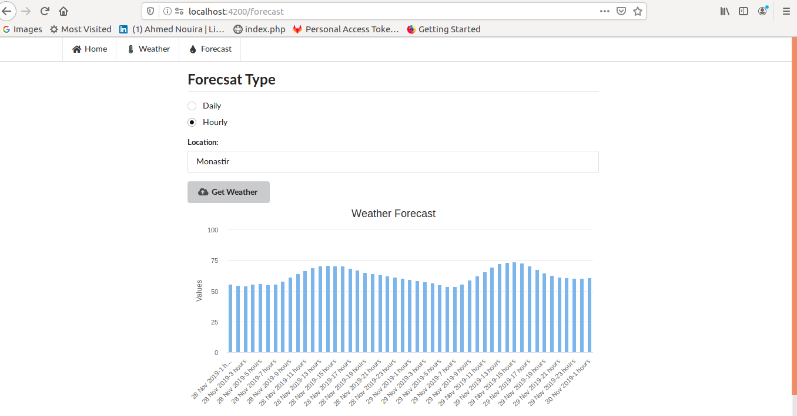

# weatherApp

* Weather Application using [Angular](https://angular.io/) font-end framework, styling with [semantic-ui](https://semantic-ui.com/), this app uses REST web service to get **geocoding** of a location and then retrieve the weather, humdity and other usefuly data and display it in charts using [angular-hightcharts](https://www.npmjs.com/package/angular-highcharts) libary. 

### Overview 

## Development server

Run `ng serve` for a dev server. Navigate to `http://localhost:4200/`. The app will automatically reload if you change any of the source files.

## Build

Run `ng build` to build the project. The build artifacts will be stored in the `dist/` directory. Use the `--prod` flag for a production build.

## Running unit tests

Run `ng test` to execute the unit tests via [Karma](https://karma-runner.github.io).

## Running end-to-end tests

Run `ng e2e` to execute the end-to-end tests via [Protractor](http://www.protractortest.org/).

